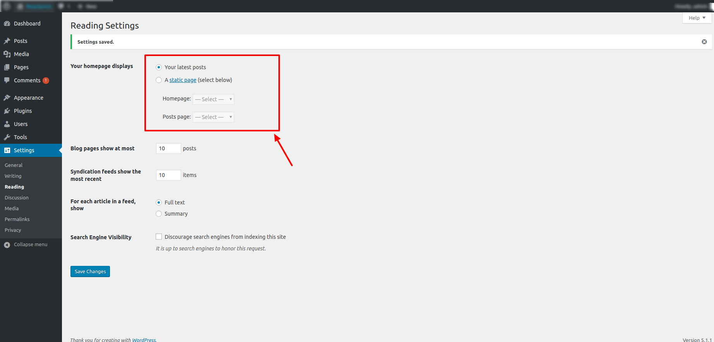
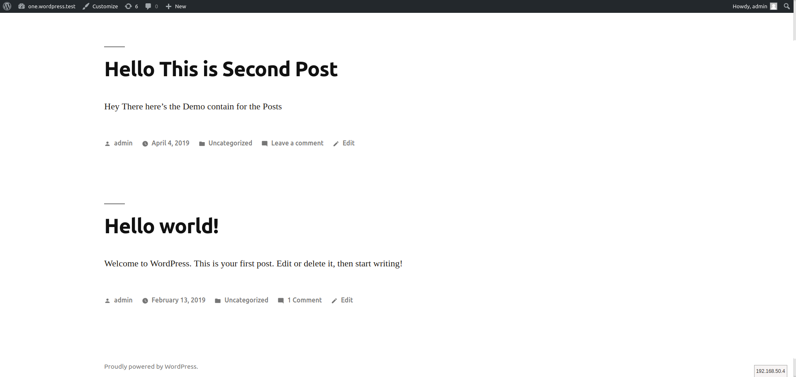

# Setting A Static Page As Your Homepage

## Description

Most WordPress themes are set up to show your most recent blog post as your front page, but have you wondered how to create a static page as your homepage on your WordPress website? If so, this lesson is for you. In this lesson you will learn how to set up a static page as the homepage on your website.

## Objectives

After completing this lesson you will be able to:

*   Create a static front page called "Home" and a page with a feed of posts called "Blog" that will be accessible from the navigation menu.

## Prerequisite Skills

You will be better equipped to work through this lesson if you have experience in and familiarity with:

*   the [Settings](https://make.wordpress.org/training/handbook/user-lessons/settings/) lesson
*   the [Pages vs Posts](https://make.wordpress.org/training/handbook/user-lessons/pages-vs-posts/) lesson

## Assets

*   [Theme Unit Test Data](https://wpcom-themes.svn.automattic.com/demo/theme-unit-test-data.xml)
*   A default WordPress theme

## Screening Questions

*   Have you ever wanted to make a front or home page that does not show blog posts?
*   Have you noticed when visiting other websites that there is a page called "blog" that shows a listing of the most recent blog posts?

## Teacher Notes

*   The lesson should alternate between short lectures and live demos. You as the teacher need a working local WordPress installation for the demos.
*   With the exceptions of the exercises, students should not be working on their site during lectures and demos. Questions from students will be very specific to their case, so it’s better to plan a period where they can test things on their site and you answer their questions individually.

## Hands-on Walkthrough

There are various reasons why people desire to have a static page as their homepage. These types of homepages can display a landing page, a portfolio, a marketplace, or many other possibilities. WordPress is set up in such a way that by default the front page displays the latest posts from your blog. Having a static page is a feature that will be useful for those who desire to keep their blog in a separate location within their site.

### Determine your Home or Front Page

The first step will be to determine which page you will utilize for your "Front Page". When using the theme unit test data, a page has already been designated for this purpose and is called "Front Page." If you are using another theme, you can create a new page called "Home" for this purpose.

### Determine your Blog Page

Secondly, you will need to determine which page will be designated as your "Blog" page. When using the theme unit test data, a page called "Blog" is already in place. If you are not using the theme unit test data and are using another theme, you can create a page called "Blog" to use as your blog landing page.

### Assign the front page and blog in Settings -> Reading

By default, WordPress installs all new sites to display blog post excerpts on the front or home page.  When you visit Settings -> reading, it will look like this.

And the front page content will display like this:

To configure your site to display a specific page on the front or home page, select "A static page" in **Settings -> Reading**.  Select which page should be the front page, and which page should be the blog.

_You do not need any content within the page named "Blog". This can be an entirely blank page entitled "Blog"._

Save changes and view your home page.

Go to the "Blog" page you've created to preview your blog page.

## Exercises

*   Create a static front page and blog page

## Quiz

**Will your default WordPress install have a static front page?**

1.  Yes
2.  No

**Answer:** 2\. No 

**Where do you change from a blog post preview to a static front page?**

1.  Settings -> Reading
2.  Settings -> Writing
3.  Settings -> General

**Answer:** 1\. Settings -> Reading

**Which is the default front page in wordpress?**

1.  Faq Page
2.  Contact Page 
3.  Latest post (Blog)
4.  None of above

**Answer:** 3\. Latest post (Blog)

## Additional Resources

[Creating a Static Front Page](https://codex.wordpress.org/Creating_a_Static_Front_Page) @ Codex
